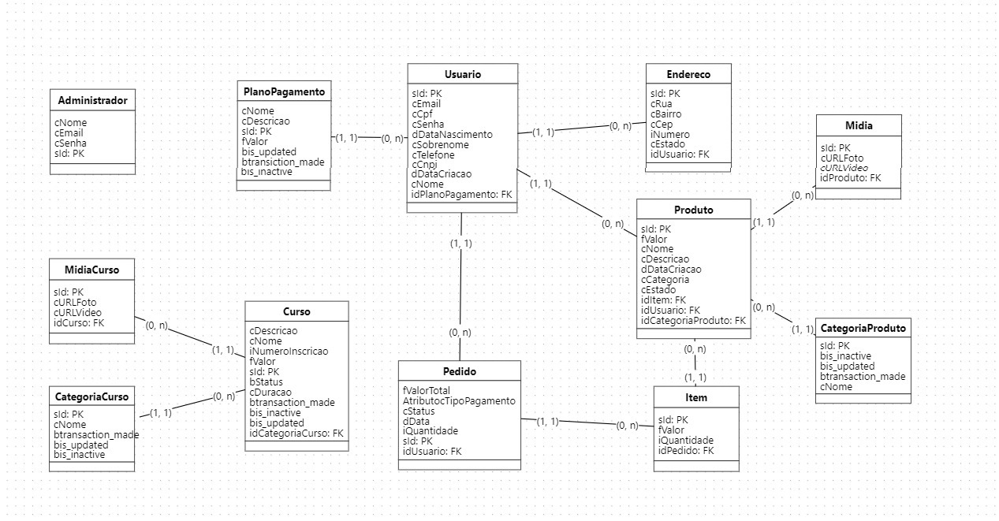
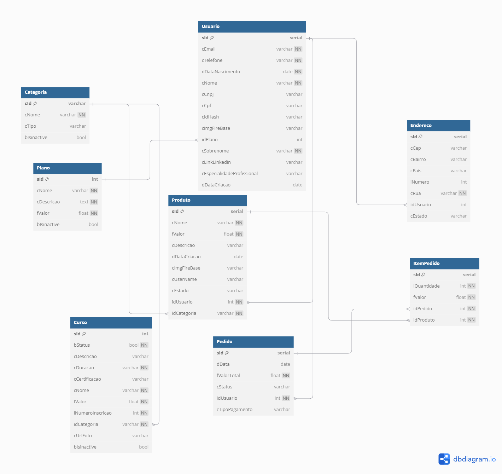

<!DOCTYPE html>
<html lang="pt-BR">
<head>
<meta charset="UTF-8">
<meta name="viewport" content="width=device-width, initial-scale=1.0">
</head>
<body>
<h1>BiMO - RPA</h1>

        Bem-vindo ao repositório dos RPA's e Script do projeto BiMO, voltado para MEIs (Microempreendedores Individuais). 
        Este projeto tem como objetivo facilitar a transação de informações entre banco de dados, assim como atualização de visualização graficas geradas no Power BI.

<h2>Funcionalidades</h2>
<ul>
<li>🎲 <strong>Atualização de dados administrativos:</strong> Atualizaremos as informações no banco de dados do app com as informações que nosso Adm's adicionarem/atualizarem/excluirem no banco de dados deles.  Para as seguintes tabelas:</li>
<ul>
<li> <strong>CategoriaProduto e CategoriaCurso -> Categoria</strong></li>
<li> <strong>Plano -> Plano</strong></li>
<li> <strong>Curso -> Curso</strong></li>
<li> <strong>MidiaCurso -> Curso</strong></li>
</ul>
<li>📈 <strong>Atualização de visualização Dash local:</strong> Atualizaremos as visualizações e dados de um Dashboard que contém avaliações e informações valiosas para nosso projeto.</li>
<li>📊 <strong>Atualização de visualização Dash feira:</strong> Atualizaremos as visualizações e dados de um Dashboard que contém avaliações do dia da feira do interdisciplinar.</li>
</ul>
<h2>Tecnologias Utilizadas</h2>
<ul>
<li>🐍 <strong>Python:</strong> Linguagem base utilizada para os Rpa's</li>
<li>💾 <strong>Postgres:</strong> Banco de dados.</li>
<li>☁️ <strong>AWS Ec2: </strong> Cloud para os Rpa's.</li>
</ul>
<h2>Modelagem do banco do primeiro:</h2>

<h2>Modelagem do nosso banco:</h2>

<h2>Bibliotecas python utilizadas:</h2>
<ul>
<li>🔗 <strong>selenium</strong></li>
<li>🌐 <strong>webdriver_manager</strong></li>
<li>🔑 <strong>python-dotenv</strong></li>
<li>💾 <strong>psycopg2-binary</strong></li>
<li>🛜 <strong>requests</strong></li>
</ul>
<h2>Criador</h2>
<ul>
<li><strong>Marcus Vinicius Righeto Thomazetti</strong> - <a href="https://github.com/MarcusVinciusRT">GitHub</a></li>
</ul>
</body>
</html>
